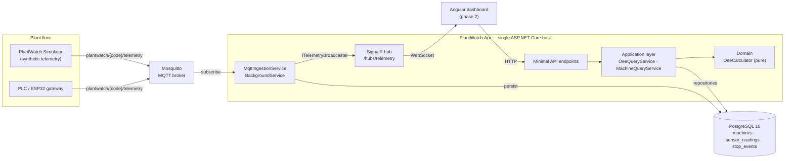

# PlantWatch

Small factories lose a large share of their capacity to causes nobody measures: a press that
idles for six minutes between orders, a lathe running fifteen percent below its rated cycle
time, a packaging line quietly scrapping one piece in twenty. The large plants solve this with
MES platforms costing six figures. The small ones write it on a clipboard, if at all.
PlantWatch is the smallest honest version of the measurement: machines publish telemetry over
MQTT, the server stores it as a time series and computes OEE — availability, performance,
quality — and exposes it over a REST and realtime API that a dashboard can read. It runs end to
end on a laptop with no hardware attached.

## Architecture



The dependency direction is inward: `Api` → `Infrastructure` → `Application` → `Domain`, and
`Domain` references nothing at all. Ingestion lives in the API host for v1 and depends only on
Application interfaces, so it can be extracted into a worker without a redesign — see
[ADR 0002](docs/adr/0002-single-host-vs-separate-worker.md).

## Run it in 2 minutes

Requires Docker and Docker Compose. Nothing else — no .NET SDK, no database, no broker, no
machine.

```bash
git clone https://github.com/Pemonition/plantwatch.git
cd plantwatch
docker compose up --build        # add -d to get your terminal back
```

That starts four containers: the Mosquitto broker, PostgreSQL, the API (which applies its
migrations and seeds three demo machines), and the simulator publishing telemetry for all three
every five seconds. `docker compose ps` should show `mosquitto`, `postgres` and `api` as
`healthy` within about a minute, and `simulator` as `running` — it has no health check because
it exposes no port to probe.

Then:

- **Swagger UI** — <http://localhost:8080/swagger>
- **Health** — <http://localhost:8080/health>
- **Machines** — <http://localhost:8080/api/machines>
- **Raw telemetry** — <http://localhost:8080/api/machines/PRESS-01/readings?take=20>
- **OEE over the last five minutes** —
  `curl "http://localhost:8080/api/machines/PRESS-01/oee?from=$(date -u -d '-5 min' +%FT%TZ)&to=$(date -u +%FT%TZ)"`

Give it two or three minutes of simulator output first. And pass `from`/`to` on a fresh stack:
`/oee` with no window defaults to the last eight hours — one shift — so a container started five
minutes ago has five minutes of run time against eight hours of planned time, and availability
comes back near zero. That is the arithmetic being right, not the system being broken, but it
reads alarmingly on a first run.

Over a window the stack has actually been up for, the three factors land where a healthy
simulated plant should: availability 0.92-0.99, performance 0.86-0.94, quality 0.88-0.98.

Watching the MQTT traffic directly, which is often the fastest way to understand the system:

```bash
docker exec -it plantwatch-mosquitto mosquitto_sub -t 'plantwatch/#' -v
```

Running from source instead, with only the infrastructure in Docker:

```bash
docker compose up -d mosquitto postgres
dotnet run --project src/PlantWatch.Api
dotnet run --project tools/PlantWatch.Simulator   # in a second terminal
```

The `Development` settings point at `localhost` for both the broker and the database, so this
works with no further configuration.

## API

| Method | Endpoint | Description |
| --- | --- | --- |
| `GET` | `/health` | Liveness check. Used by the compose health check. |
| `GET` | `/api/machines` | Lists monitored machines: code, name, ideal cycle time. |
| `GET` | `/api/machines/{code}/oee?from=&to=` | Availability, performance, quality and OEE for a period, with the raw counters they were derived from. Defaults to the last 8 hours — one shift. Returns `404` for an unknown code. |
| `GET` | `/api/machines/{code}/readings?take=` | Most recent telemetry samples, newest first. `take` defaults to 100 and is capped at 500. |
| `WS` | `/hubs/telemetry` | SignalR hub. Emits a `reading` event per ingested sample. A new connection receives every machine; `SubscribeToMachine(code)` narrows it to the machines asked for, and `UnsubscribeFromMachine(code)` on the last one returns it to the full stream. Each reading reaches a connection exactly once either way. |

Telemetry is ingested from MQTT, not posted over HTTP. The topic and payload contract is
specified in [ADR 0004](docs/adr/0004-mqtt-topic-and-payload-contract.md):

```
topic:   plantwatch/{machineCode}/telemetry
payload: {"machineCode":"PRESS-01","timestamp":"2026-10-01T12:00:05Z",
          "piecesProduced":4,"rejectedPieces":1,"isRunning":true}
```

## How the OEE math works

OEE answers one question: of the time a machine was supposed to be making good parts at full
speed, what fraction did it actually deliver? It is the product of three independent factors,
each a ratio in `[0, 1]`.

| Factor | Formula | What it loses |
| --- | --- | --- |
| Availability | `runTime / plannedProductionTime` | Breakdowns, changeovers, waiting for material or operators. |
| Performance | `(idealCycleSeconds × totalPieces) / runTime` | Running below the rated cycle time, and micro-stops too short to log. |
| Quality | `goodPieces / totalPieces` | Scrap and rework. |
| **OEE** | `availability × performance × quality` | — |

The product, not the average. A plant that is excellent at two factors and poor at the third
still has a problem, and averaging would hide it.

Worked example — one 8-hour shift, 7 hours producing, 60-second rated cycle, 400 pieces of
which 8 were scrapped:

```
availability = 420 / 480                 = 0.875
performance  = (60 × 400) / (420 × 60)   = 0.952
quality      = 392 / 400                 = 0.980
oee          = 0.875 × 0.952 × 0.980     = 0.817   (81.7%)
```

That case is asserted as a test in
[`OeeCalculatorTests`](tests/PlantWatch.Domain.Tests/Oee/OeeCalculatorTests.cs).

Two rules are enforced in `OeeCalculator`, and both are deliberate:

- **Any division by a non-positive denominator yields `0`, not an exception and not `NaN`.** A
  shift with no planned production time is a reporting gap. A dashboard that returns `500`
  because of one is worse than one that shows a gap.
- **Every factor is clamped to `[0, 1]`.** A value above 100% never means a machine exceeded
  physics; it means an input is wrong — usually an ideal cycle time entered slower than the
  machine really runs, or overtime booked against an unchanged plan. A dashboard showing 128%
  performance destroys trust in every other number on the page.

Turning raw samples into those five inputs is the job of `OeeQueryService`, and it is kept
separate from the calculator on purpose: the arithmetic must be provably correct, while the
aggregation involves judgement about imperfect field data. For example, a sample's state is
credited forward only up to five minutes, so a gateway that went offline for an hour is not
counted as production.

## Project layout

```
PlantWatch.sln
├── src/
│   ├── PlantWatch.Domain          Entities, OEE value objects, pure OeeCalculator. Zero dependencies.
│   ├── PlantWatch.Application     Repository interfaces, DTOs, use-case services, MQTT contract.
│   ├── PlantWatch.Infrastructure  EF Core + Npgsql, migrations, repositories, MQTT ingestion, options.
│   └── PlantWatch.Api             Minimal API endpoints, SignalR hub, DI wiring, Dockerfile.
├── tools/
│   └── PlantWatch.Simulator       Publishes synthetic telemetry for 3 machines. No hardware needed.
├── tests/
│   └── PlantWatch.Domain.Tests    xUnit coverage of the OEE calculation.
├── infra/mosquitto/               Broker configuration (anonymous; development only).
├── docs/
│   ├── adr/                       Architecture decision records.
│   └── learning-log.md            Where prior coursework is actually applied here.
├── web/                           Angular dashboard — placeholder, phase 2.
└── docker-compose.yml             Broker, database, API, simulator.
```

Build and test locally with the .NET 9 SDK:

```bash
dotnet build
dotnet test
```

CI runs restore, build and test on every push and pull request
([`.github/workflows/ci.yml`](.github/workflows/ci.yml)).

## Roadmap

**Phase 1 — telemetry and OEE (current).** MQTT ingestion, time-series storage, OEE over an
arbitrary period, REST and realtime API, simulator, containerised stack.

**Phase 2 — Angular dashboard.** Plant overview with live machine tiles, per-machine detail with
the three factors charted over time, and a stop timeline. The API it consumes already exists and
is documented in [`web/README.md`](web/README.md).

**Phase 3 — natural-language queries over telemetry.** "Which machine lost the most time last
week, and to what?" translated into a bounded query over the same repositories, with the
generated query and the rows it returned shown alongside the answer. The point is to make the
data reachable by the person who runs the factory rather than only by whoever can write SQL —
which means the answer has to be auditable, not just fluent.

Also tracked, unscheduled: deriving `StopEvent` records from reading gaps, retention and
downsampling (see [ADR 0003](docs/adr/0003-postgres-timescale-for-telemetry.md)), per-machine
MQTT authentication, and authentication on the API.

## Why this project exists

I spent years as an electrician and on factory floors before moving into software, and the OEE
problem is one I have watched go unmeasured in person; this is the project where that background
and the .NET work meet, built to the standard I would want to be held to.

## License

MIT — see [LICENSE](LICENSE).
